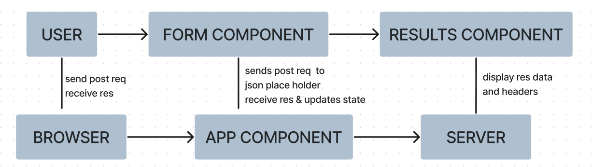
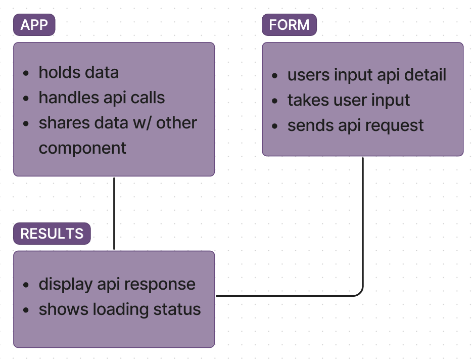

# RESTy

**Author**: Wajiha Khan

**Version**: 1.0.0

**Overview**:

Phase 1 lays the groundwork for the project by setting up the development environment, organizing the project structure, implementing core features, conducting basic testing, and creating initial documentation. It establishes the foundation for subsequent phases and ensures a structured approach to project development.

**Version**: 2.0.0

**Overview**:

Phase 2, we enabled user input for API requests and managed state in our React application using the useState hook. The App component was converted to a functional component to facilitate state management. Users can enter an API URL and select the HTTP method (GET, POST, PUT, DELETE). For GET requests, we used the Star Wars API (SWAPI), and for POST, PUT, and DELETE requests, we used JSONPlaceholder, a testing REST API.

**Version**: 3.0.0

**Overview**:

Phase 3 of the project focuses on enhancing RESTy's capabilities by enabling users to interact with live APIs and retrieve data. By implementing features like HTTP request handling and response display, the application becomes a powerful tool for developers to test and explore APIs efficiently. With thorough testing and potential future enhancements, RESTy can become even more versatile and user-friendly.

