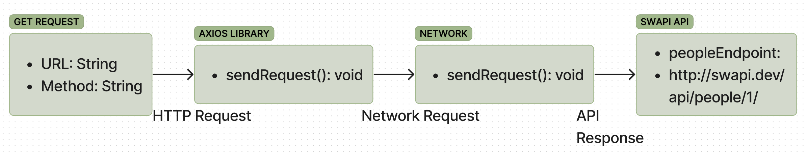

# RESTy

**Author**: Wajiha Khan

**Version**: 1.0.0

**Overview**:

Phase 1 lays the groundwork for the project by setting up the development environment, organizing the project structure, implementing core features, conducting basic testing, and creating initial documentation. It establishes the foundation for subsequent phases and ensures a structured approach to project development.

{ width=400 }
